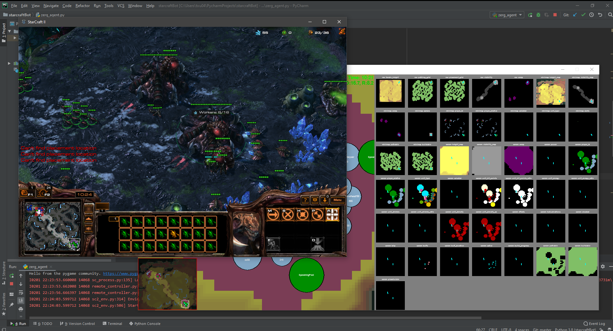
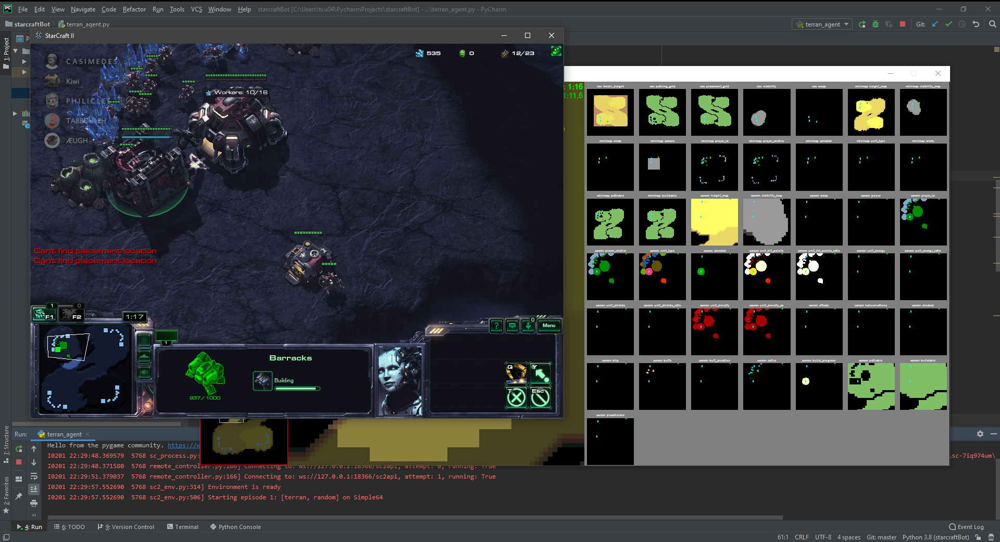

# PySC2-Starcraft-bot
## Starcraft AI scripts

Introductory and learning scripts for simple Starcraft 2 agents. 

For learning basic functions in deepmind's [PySC2 - StarCraft II Learning Environment](https://github.com/deepmind/pysc2) 

Agents currently gather resources to rush the enemy with constant waves of basic units.


(Adapted from original source from online tutorial [Build a Zerg Agent with PySC2 2.0](https://www.youtube.com/watch?v=Saj-rhXP6tM&))

Currently not much machine learning yet :(

Experimenting with all races and executing different builds to get familiar with PySC2 :)



## Prerequisites

### Get PySC2

Easiest way is to use pip

```
$ pip install pysc2
```

More information in [PySC2 - StarCraft II Learning Environment](https://github.com/deepmind/pysc2) 
